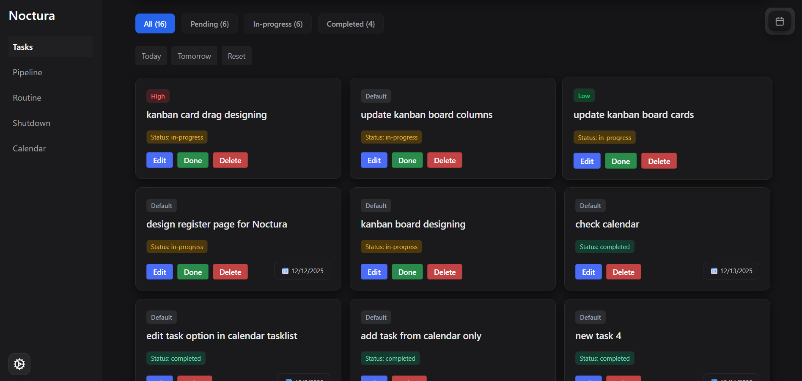
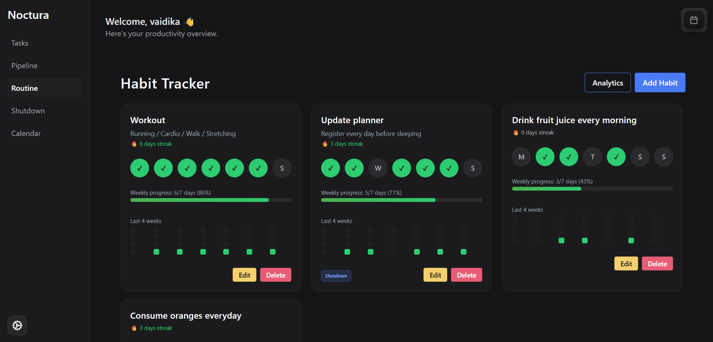
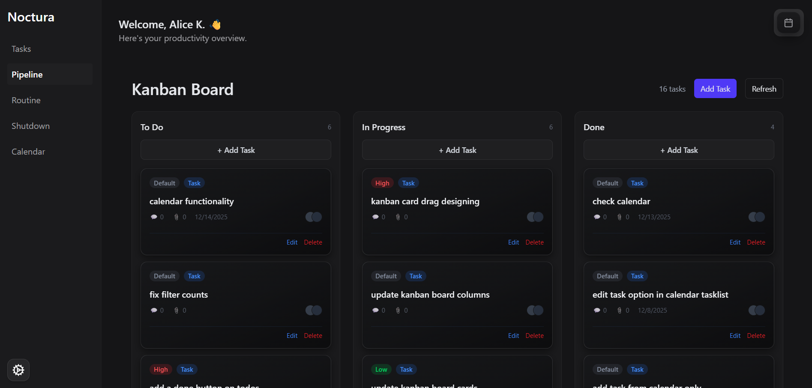
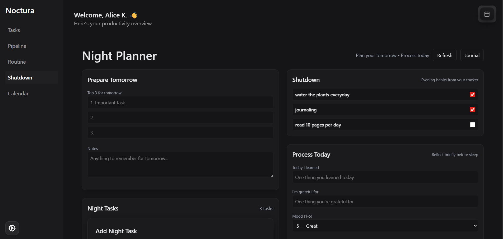
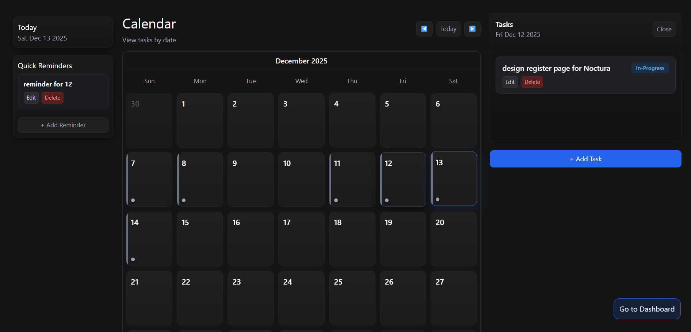
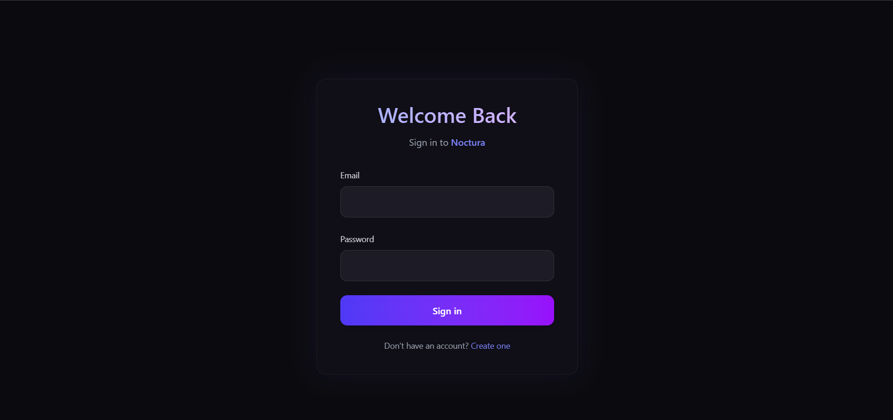

# **Noctura**
### *Master Your Day, Embrace the Night*

Noctura is a modern, dark-themed productivity web application designed to help you plan, organize, and reflect — without overwhelming you.  
It combines structured productivity for the day with optional mindful routines for the night, all wrapped in a calm, minimal interface.

Built with scalability and real-world usage in mind, Noctura supports task management, habit tracking, Kanban workflows, reminders, and an optional night planner — all in one place.

🔗 **Live Demo:** https://noctura-app.onrender.com

---

## 🚀 Features

### ✅ **Smart To-Do System**
- Create, edit, delete, and complete tasks  
- Status-based organization (Pending, In-Progress, Completed)  
- Priority support (Low → Urgent)  
- Clean and distraction-free task views  

---

### 📊 **Powerful Habit Tracker**
- Daily habit creation and tracking  
- Simple, visual progress representation  
- Optimized layouts for both mobile and desktop  

---

### 🗂️ **Kanban Workflow Board**
- Backlog → Pending → In-Progress → Done flow  
- Drag & drop task movement  
- Ideal for visual thinkers and project-style planning  

---

### 🌙 **Night Planner**

- Reading routines  
- Meditation & mindfulness  
- Skincare / self-care habits  
- Night reflections & wind-down tasks  

Designed to appear **only when you want it**, keeping the app flexible.

---

### 🗓️ **Day Planner & Calendar**
- Date-based task planning  
- Calendar view with reminders  
- Dashboard overview of daily workload  

---

### 🎨 **Dark, Minimal UI**
- Carefully crafted dark theme  
- Smooth animations and subtle motion  
- Responsive across all screen sizes  
- Designed to reduce visual fatigue  

---

### 🔐 Authentication

## 🧱 Tech Stack

**Frontend**
- React (Vite)
- Tailwind CSS
- Axios
- React Router

**Backend**
- Node.js
- Express.js (v4)
- JWT Authentication

**Database**
- MongoDB (Mongoose)

**Deployment**
- Render (Single Web Service)
- Frontend + Backend bundled together

---

## 🏗️ Project Architecture

Noctura is deployed as a **single bundled MERN application**.

/client → React frontend (Vite)
/server → Node.js + Express backend
/server/routes → API routes
/server/models → MongoDB schemas
/server/middleware → Auth & utilities

In production, the React build (`client/dist`) is served directly by the Express server.

---

## 🌐 Environment Setup

### Local Development

## Frontend and backend run separately:

| Service | URL |
|------|-----|
| Frontend | http://localhost:5173 |
| Backend  | http://localhost:5000 |

---

### 🚀 Deployment Notes

- Frontend is built automatically during backend installation

- Express serves the React app in production

- All APIs are prefixed with /api

- Axios switches automatically between dev & prod using environment variables

- Express v4 is used for stable wildcard routing

---

### 🧩 Roadmap

- Habit streaks & analytics

- User insights dashboard

- Push & email notifications

- PWA offline support

- Enhanced calendar integrations

---

### 👩‍💻 Author

Noctura was designed and developed by **Vaidika Kaul**.

You are free to clone and learn from this project.
If you reuse or modify significant portions of the code, credit is appreciated.

---

## 🤝 Contributing

Contributions, suggestions, and improvements are welcome!

If you’d like to contribute to **Noctura**, please read the contribution guidelines before getting started:

👉 **[Contributing Guidelines](CONTRIBUTING.md)**

Please ensure proper attribution is maintained when forking or building upon this project.

---

## 📜 License

This project is licensed under the **MIT License**.  
See the [LICENSE](LICENSE) file for details.

---

### ⭐ Final Note

Noctura is not just a task manager —
it’s a flexible system designed to adapt to how you want to work and unwind.

---

### End of README.md
